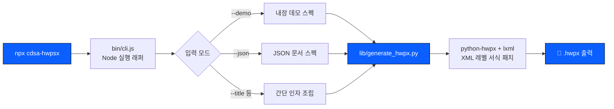

<div align="center">

# ▲ CDSA-HWPSX

### `MISSION: GOVERNMENT DOCUMENT AUTOMATION`

**행정안전부 표준서식 HWPX 문서 생성 시스템**

[](https://www.npmjs.com/package/cdsa-hwpsx)
[](https://www.npmjs.com/package/cdsa-hwpsx)
[](https://nodejs.org)
[](#license)
[](#)

━━━━━━━━━━━━━━━━━━━━━━━━━━━━━━━━━━━━━━━━━━━━━━━━━━━━━━━━━━━━━━━━

**한 줄의 명령으로, 실제 공문서 서식 그대로.**
설치 없이 `npx` 하나로 발사됩니다.

```
npx cdsa-hwpsx --demo
```

━━━━━━━━━━━━━━━━━━━━━━━━━━━━━━━━━━━━━━━━━━━━━━━━━━━━━━━━━━━━━━━━

</div>

<br>

## 🛰 OVERVIEW

`cdsa-hwpsx`는 **행정안전부 'AI 친화 행정문서 작성 가이드라인'** 기반 표준서식을
XML 레벨에서 그대로 재현하여, HWPX 문서를 코드 한 줄로 생성하는 CLI입니다.

대제목(Ⅰ.) · 중제목(□) · 본문(○) · 하위(-) · 주석(※) · 결론(⇒) 체계와
3종 지정 폰트(HY헤드라인M / 휴먼명조 / 맑은 고딕)를 규칙 그대로 적용합니다.

> AX(AI Transformation) 교육·컨설팅 현장에서 "AI가 실제 업무 산출물을,
> 그것도 표준 서식 그대로 만들어낼 수 있는가"라는 질문에 대한 실전형 답입니다.
> 서식 생성 엔진(Python)과 실행 인터페이스(Node CLI)를 분리해,
> **에이전트 기반 업무자동화**를 실습형으로 보여주기 위해 설계했습니다.

<br>

## 🚀 LAUNCH SEQUENCE

<table>
<tr><td width="90"><b>T-3</b></td><td>

```bash
npx cdsa-hwpsx --demo
```
데모 문서 즉시 생성 (`보고서_데모.hwpx`)

</td></tr>
<tr><td><b>T-2</b></td><td>

```bash
npx cdsa-hwpsx --json examples/sample-doc.json
```
JSON 스펙 기반 생성 — 다단 섹션 · 표 · 주석 · 결론 전부 지원

</td></tr>
<tr><td><b>T-1</b></td><td>

```bash
npx cdsa-hwpsx \
  --title "AX 컨설팅 도입 계획 보고" \
  --dept "AI정책과" \
  --author "김태유 사무관" \
  --content "AX 컨설팅 및 업무자동화 도입을 추진함." \
  --output plan.hwpx
```
간단 인자 모드 — 빠른 1회성 문서

</td></tr>
<tr><td><b>T-0</b></td><td>🔵 <b>DOCUMENT DEPLOYED</b></td></tr>
</table>

<br>

## 🧭 SYSTEM ARCHITECTURE



<br>

## 📋 REQUIREMENTS

| 구성 요소 | 버전 |
|---|---|
| Node.js | ≥ 16 |
| Python | ≥ 3.9 |
| python-hwpx, lxml | 최초 실행 시 자동 설치 시도 |

<br>

## 🎯 FORMAT SPEC

| 요소 | 기호 | 폰트 | 크기 |
|---|:---:|---|:---:|
| 대제목 | `Ⅰ. Ⅱ. …` | 맑은 고딕 (Bold) | 15pt |
| 중제목 | `□` | HY헤드라인M | 16pt |
| 본문 | `○` | 휴먼명조 | 15pt |
| 하위 | `-` | 휴먼명조 | 15pt |
| 주석 | `※` | 맑은 고딕 | 12pt |
| 결론 | `⇒` | 휴먼명조 | 15pt |

규칙: 셀 병합 금지 · 표준 번호체계 준수 · 줄간격 본문 160% / 제목 130%

<br>

## 🔧 LOCAL DEVELOPMENT

```bash
git clone https://github.com/shoman2/cdsa-hwpsx.git
cd cdsa-hwpsx
node bin/cli.js --demo
```

## 📦 DEPLOY

```bash
npm login
npm publish --access public
```

<br>

━━━━━━━━━━━━━━━━━━━━━━━━━━━━━━━━━━━━━━━━━━━━━━━━━━━━━━━━━━━━━━━━

## 👨‍🚀 MISSION LEAD

<div align="center">

### 김태유
**AX(AI Transformation) 전문교수 · AI 박사**

</div>

기업·공공기관 대상 AI 콘텐츠 기반 강의를 다수 수행하며, AI PoC(Proof of Concept)를
수행하고 **업무자동화를 에이전트 기반으로 상세히 설계·설명**하는 AI 박사입니다.
컨설팅을 포함한 비즈니스를 직접 운영하며, "AI가 실제 업무 산출물을 만들어내는
실습형 도구"를 지속적으로 만들고 공유합니다.

━━━━━━━━━━━━━━━━━━━━━━━━━━━━━━━━━━━━━━━━━━━━━━━━━━━━━━━━━━━━━━━━

<div align="center">

**MIT License** · Built with 🔵 for Korean AX practitioners

</div>
